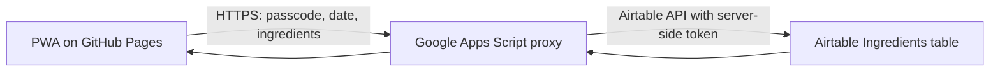

# Magnus 100 Food Tracker

A small, installable web app for recording the first time a child tries each ingredient. It is built for the ordinary, slightly chaotic moment after a meal: type a simple list, choose the date, and keep a shared list moving toward 100 foods.

The public PWA is intentionally unconfigured. It contains no family data, Airtable credentials, shared passcode, or pre-filled service endpoint. A family connects its own private Google Apps Script deployment on each device.

## What it does

- Accepts a quick ingredient list such as `blended prawns, carrot, and corn`.
- Previews a conservative parse: `Prawn`, `Carrot`, and `Corn`.
- Tracks one record per ingredient and a first-exposure date.
- Prevents duplicate records and preserves an earlier corrected date.
- Shows progress toward 100 ingredients and supports searching the saved list.
- Works well as an iPhone home-screen PWA.

It deliberately does not try to be a meal diary, nutrition app, allergy tracker, or recipe parser. A dish such as `chicken porridge` stays one ingredient name; enter `chicken, rice, carrot` when those are the ingredients to track.

## Architecture



The browser is only the interface. The proxy owns the Airtable token, checks the shared family passcode, normalizes and de-duplicates ingredients again on the server, and updates Airtable. The full technical design, data model, security model, and API behavior are in [Architecture](docs/ARCHITECTURE.md).

## Try the interface

The deployed public shell is available at [clemwgk.github.io/magnus-100-food-tracker](https://clemwgk.github.io/magnus-100-food-tracker/). It needs a family's own deployed proxy URL and passcode before it can read or save any data.

## Run locally

This project uses Vite, React, TypeScript, Vitest, and Playwright. On this Windows setup, use `npm.cmd` in PowerShell:

```powershell
npm.cmd ci
npm.cmd run dev
```

Then open the local address shown by Vite. Save an Apps Script `/exec` URL in Settings; that value stays in the browser storage for that device only. The passcode is memory-only and is cleared on a full reload.

## Quality checks

```powershell
npm.cmd run lint
npm.cmd run test
npm.cmd run test:e2e
npm.cmd run secret:scan
npm.cmd run build
```

For setup, deployment, the disposable live-test gate, and how to contribute safely, see [Development](docs/DEVELOPMENT.md).

## Privacy and security notes

- No Airtable token, base ID, passcode, hash, salt, or real ingredient history belongs in this repository or the static site.
- The PWA never calls Airtable directly.
- The public health endpoint reveals only whether the proxy has been configured. Reading and saving require the shared passcode.
- The passcode is a lightweight family access gate, not a substitute for individual accounts or healthcare-grade security.

## License

This project is shared as a portfolio artifact. No license has been granted for reuse.
