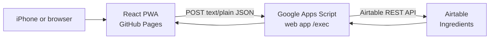

# Architecture

## Product boundary

Magnus 100 Food Tracker is a focused family tool for recording first ingredient exposures. The data model stays deliberately small: one canonical record per ingredient and the earliest date it was offered.

The app does not retain raw meal text, recipe history, parent identities, portions, reactions, allergies, or a meal-event timeline. Those omissions are intentional: the product optimizes for quick daily use and an editable, understandable family record rather than a complete feeding journal.

## System design



| Component | Responsibility | Persistent data | Security boundary |
| --- | --- | --- | --- |
| React PWA | Ingredient entry, local preview, progress, search, and friendly error states. | Device-local endpoint, draft, and last snapshot. | Must never contain Airtable credentials or a baked-in endpoint. |
| Google Apps Script | Passcode verification, server-side normalization, locking, de-duplication, and Airtable requests. | Script Properties for credentials and passcode verifier. | The only place the Airtable token and base ID exist. |
| Airtable | Editable source of truth for ingredient records. | The `Ingredients` table. | Accessible only through the proxy token for normal PWA use. |

### Why this shape

A static PWA is inexpensive, simple to install, and appropriate for an iPhone-first interface. Airtable gives the family a practical admin surface for inspecting or correcting records. A small Apps Script layer keeps the Airtable personal access token out of public JavaScript without adding another paid backend.

The trade-off is purposeful: Apps Script deployment is a manual step, and the shared passcode is lightweight protection rather than full user authentication. This remains suitable for a small trusted household and a low-sensitivity ingredient list, but it should be revisited before storing medical information or sharing access more broadly.

## Data model

The Airtable base uses one `Ingredients` table with these fields:

| Field | Type | Purpose |
| --- | --- | --- |
| `Name` | Single line text | Human-readable ingredient name, such as `Cauliflower`. |
| `Key` | Single line text | Canonical lowercase de-duplication key, such as `cauliflower`. |
| `First Exposure Date` | Date, without time | Earliest known date the ingredient was offered. |
| `Notes` | Long text | Optional family note. |
| `Created At` | Created time | Airtable-generated audit timestamp. |

The proxy treats `Key` as unique even though Airtable does not enforce uniqueness itself. It takes an Apps Script lock, re-reads the current records, creates only missing keys, and changes a stored date only when the new date is earlier.

### Correcting data

Airtable is the editing surface for the current MVP. For a straightforward typo, change both `Name` and its matching lowercase `Key`. If the corrected key already exists, retain the correct row with the earliest date and remove the duplicate typo row. Re-entering the food through the PWA would create a separate key, so it is not a correction workflow.

## Ingredient handling

The client preview and proxy use the same conservative approach:

1. Split input on commas, semicolons, new lines, or the standalone word `and`.
2. Trim whitespace and remove a short list of leading preparation words such as `blended`, `mashed`, or `steamed`.
3. Remove surrounding punctuation and normalize casing.
4. Apply limited singular rules, while protecting words such as `bass`, `cress`, and `asparagus`.
5. De-duplicate within the submitted list while preserving its order.

The system does not infer ingredients from dish names or merge synonyms. This conservative choice favors an occasional easy-to-repair duplicate over an incorrect merge in a child's first-exposure history.

## API behavior

The Apps Script deployment has one `/exec` endpoint:

| Request | Access | Purpose |
| --- | --- | --- |
| `GET?action=health` | Public | Reports whether required Script Properties are present; returns no secret values. |
| `POST { action: "snapshot", passcode }` | Shared passcode | Returns the ingredient list and `N / 100` summary. |
| `POST { action: "saveIngredients", passcode, exposureDate, ingredients }` | Shared passcode | Creates missing ingredients and corrects dates that are earlier. |
| `POST { action: "verifyTestTarget", passcode, expectedBaseId }` | Shared passcode, test-only | Refuses a live test unless the proxy is configured for the named disposable base. |

The browser sends JSON as `text/plain` and no custom authorization headers. This keeps the Apps Script web-app transport simple and avoids an unnecessary browser preflight request. Responses expose only safe application data or a stable error code and message.

## Device and offline behavior

The PWA service worker caches the app shell, never API responses. The last successfully fetched ingredient snapshot, an unsent draft, and the endpoint setting are stored locally for convenience. The saved endpoint is not shared between devices or between a browser tab and a separately installed home-screen PWA. Saving requires a connection; a failed save keeps the typed text so it can be retried.

## Secrets

The deployed Apps Script project uses these Script Properties:

```text
AIRTABLE_TOKEN
AIRTABLE_BASE_ID
FAMILY_PASSCODE_HASH
FAMILY_PASSCODE_SALT
```

Enter their values directly in the Apps Script user interface. Never commit or share the actual values, a deployed proxy URL, or family ingredient records in source files, screenshots, issues, or logs.
