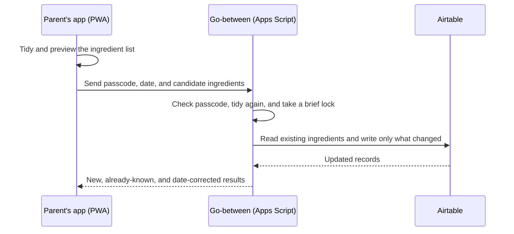

# Product brief

## Why this exists

When a baby starts solids, the practical goal many parents follow is to introduce
a wide variety of single ingredients — a common rule of thumb is to reach around
100 different foods in the first year or so. The hard part is not cooking; it is
remembering. Across two parents, several weeks, and a lot of half-finished meals,
the real question keeps coming back: *have we already given the baby fennel, and
if so, when was the first time?*

A shared note or a spreadsheet can answer that, but in practice both drift: one
parent edits, the other doesn't see it, the same food gets logged twice with two
different dates, and nobody trusts the count. This project is a small, shared tool
that makes that one question reliable — and nothing more.

## In plain terms

It is a phone-friendly web app that two parents share. After a meal, either parent
types what the baby tried (`blended prawns, carrot, and corn`), picks the date, and
saves. The app keeps one entry per ingredient with the *earliest* date it was
offered, prevents the same food being recorded twice, and shows progress toward 100.

A few terms used throughout this brief, in everyday language:

- **PWA** ("progressive web app") — a website you can add to the iPhone home screen
  so it opens and behaves like an installed app, without going through the App Store.
- **Airtable** — a friendly online spreadsheet/database. It is the **source of
  truth**: the one place the real list lives, and the place a parent can open and
  fix a mistake by hand.
- **The go-between (a "proxy")** — a tiny piece of code that sits between the app and
  Airtable. The app talks to the go-between; the go-between talks to Airtable. Why
  that indirection is necessary is explained below — it is the most important design
  decision in the project.

## The brief

Build a small shared tool for two parents to record a child's first exposure to
distinct ingredients and see progress toward 100 foods. It had to be pleasant to
use on an iPhone, useful in the few minutes after a meal, and inexpensive to run.

The success measure was not a sophisticated nutrition product. It was a reliable
answer to a simple question: *has this ingredient already been introduced, and when
was it first offered?*

## Requirements and constraints

| Need | Design implication |
| --- | --- |
| Two people need one shared record. | Use a central, online list rather than separate device-only notes. |
| Daily entry must be quick on iPhone. | Build one focused mobile screen, with plain-text entry and an installable PWA. |
| The data must be correctable without engineering help. | Use Airtable as an editable source of truth a parent can open and fix directly. |
| There should be no recurring backend cost or new operational burden. | Host the app for free on GitHub Pages and use Google Apps Script (free) as the small go-between. |
| A browser cannot safely hold the Airtable key. | Keep the Airtable access token in the go-between, never in the app (see "Why a phone app can't talk to the database directly"). |
| A food may be logged after the meal. | Keep the earliest known date for an ingredient and allow an earlier correction, without later entries overwriting it. |

## Scope: what was intentionally built, and what was not

The application records one canonical ingredient and its earliest known date. A
parent can enter `blended prawns, carrot, and corn`; the app tidies that into three
clean ingredients — `Prawn`, `Carrot`, `Corn` — saves any that are new, and shows
progress. (This tidying step — stripping "blended", de-pluralising, and dropping a
food already on the list — is called **normalization and de-duplication** elsewhere
in the docs.)

The following were deliberately left out of the first version:

- meal or raw-text history;
- recipe parsing or nutrition analysis;
- allergy, reaction, or medical tracking;
- individual accounts and roles;
- a custom admin screen for edits;
- saving while offline.

These are not omissions by accident. Each would add data, privacy, support, or
reliability cost without improving the core job enough to justify it. Airtable is
the escape hatch for correcting a mistake, while the app stays fast for normal use.

## Key decisions

| Decision | Why it fits | Trade-off accepted |
| --- | --- | --- |
| One `Ingredients` list, not meals or aliases. | The product needs one record per ingredient and its earliest date. Meals, aliases, and linked records would add complexity without helping that core task. | No meal history and no automatic synonym matching. |
| Airtable as source of truth. | It is easy for a non-engineer to inspect and correct directly. | The structure is managed by hand and must keep exact field names. |
| A Google Apps Script go-between. | It keeps the Airtable key off the public site without paying for or running a separate server. | Deploying it is a manual step, and the platform is intentionally simple. |
| A GitHub Pages PWA for the interface. | It is free, installable, and well suited to an iPhone-first single screen. | A free static site cannot store a secret, so each device enters its own go-between address once. |
| Shared passcode instead of accounts. | Proportionate for a small trusted household; avoids account-management friction. | It is lightweight access control, not identity or healthcare-grade security. |
| Conservative tidying and server-side de-duplication. | A harmless duplicate is easier to fix than a wrong merge in a first-exposure record. | The app does not guess ingredients from a dish or solve every plural/synonym case. |
| Online saves, keeping the draft after a failure. | Keeps the data consistent and simple while not losing what was typed. | There is no offline save queue in this version. |

## How the solution works

The app's preview is a convenience, not the authority. The go-between repeats the
tidying and briefly **locks** (so two saves can't run at once) before re-checking
Airtable. That protects against two parents saving the same new ingredient at nearly
the same moment, and makes date correction predictable: an earlier date is accepted;
a later date never overwrites the existing one.

## Why a phone app can't talk to the database directly

The obvious design is simpler than what was built: just have the app talk to
Airtable directly, with no go-between. It is worth being explicit about why that
simpler version was rejected, because the whole architecture turns on it.

1. **Airtable only answers a request that carries a secret key** (an access token).
   Anything that reads or writes the data must present that key.
2. **The app is a free static site with no server of its own.** Every line of its
   code, and every network request it makes, runs on the parent's phone — and can be
   read by anyone who opens the browser's developer tools.
3. **So "talk to Airtable directly" really means shipping the secret key inside the
   app, to every phone that loads it.** Anyone who installed the app — or just opened
   its network tab — could lift the key and then read, change, or delete all of the
   family's data.
4. **Hiding the key doesn't help.** Putting it in a build setting only bakes it into
   the delivered files; it still arrives on the device and can still be recovered. A
   secret handed to the browser is not a secret.
5. **Conclusion: the key has to live somewhere with a server**, which calls Airtable
   on the app's behalf and never reveals the key to the phone. The cheapest such
   place that needs no server to run and costs nothing is **Google Apps Script** —
   so that is what holds the key. This is the entire reason the go-between exists; it
   is not an extra database or an arbitrary middleman.

Think of it as a locked mailbox with a doorman. Parents hand the doorman a note (the
passcode and the day's ingredients); the doorman holds the only key, opens the box,
and hands back just the answer. The key never leaves the building.

With that settled, the go-between does four jobs the static app cannot do safely on
its own:

1. It keeps the Airtable key and base address in server-side settings, off every
   phone.
2. It checks the shared passcode before returning family data or changing anything.
3. It performs the authoritative tidy, duplicate check, and locked re-read before a
   write, so two devices can't corrupt the record.
4. It returns only the small, safe answer the app needs, instead of exposing Airtable
   directly.

This keeps the convenience of a free, installable app while keeping the secret key
and the write integrity on the server side.

For the exact system boundaries, request/response contract, data model, local
storage behaviour, and secret handling, see the [technical guide](TECHNICAL_GUIDE.md).

## AI-assisted delivery approach

AI was used as an implementation partner inside a deliberately constrained workflow,
not as an autonomous product owner.

1. The product owner set the problem, the non-negotiable constraints, and the scope
   boundary: shared iPhone use, low/no incremental cost, Airtable as the editable
   record, and no exposed credentials.
2. The work was decomposed into a short architecture spike, a small app, the
   go-between, deployment, and verification. The go-between connection was proven
   before the rest of the interface was treated as finished.
3. The implementation was kept reviewable: the tidying and date logic are small,
   self-contained functions with tests; the boundary that talks to the go-between is
   isolated; the Apps Script code is kept separate from the app.
4. The risky, human-owned actions stayed human-controlled: creating credentials,
   storing the secret settings, deploying Apps Script, and choosing who can reach it.
5. Changes are checked with automated linting, unit and integration tests, browser
   tests at desktop and iPhone-sized screens, a production build, and a secret scan.
   Live write checks are restricted to a disposable, throwaway Airtable base — never
   the family's data.

The repository is meant to show that working pattern as much as the app itself:
requirements, trade-offs, credentials, verification criteria, and release authority
are all kept explicit and reviewable, with AI used to accelerate the structured
execution in between.

## Evidence and current limitations

The project includes commands for linting, unit and integration tests, browser
end-to-end tests, a production build, and secret scanning. The browser suite covers
the core save flow, offline-failure behaviour, and the installable assets at desktop
and iPhone screen sizes. The optional live harness is deliberately guarded so it can
only ever write to an explicitly named throwaway base.

Current limitations are visible rather than hidden:

- a typo is corrected in Airtable rather than inside the app;
- the go-between address is entered separately on each device or installed app;
- passcode protection suits a trusted household, not multi-user authentication;
- live Airtable write tests need a throwaway base set up by hand;
- the app intentionally makes no medical or dietary recommendations.

Each of those would be a sensible next decision only if real use shows it solves a
meaningful problem. Until then, keeping the implementation small is a feature, not a
missing roadmap.
