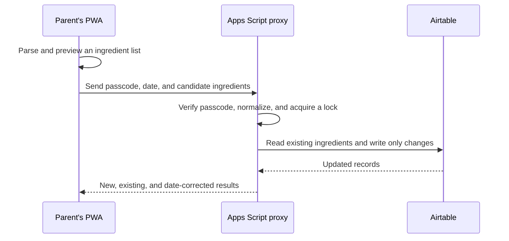

# Product brief

## The brief

Build a small shared tool for two parents to record a child's first exposure to distinct ingredients and see progress toward 100 foods. It had to be pleasant to use on an iPhone, useful in the few minutes after a meal, and inexpensive to run.

The success measure was not a sophisticated nutrition product. It was a reliable answer to a simple question: *has this ingredient already been introduced, and when was it first offered?*

## Requirements and constraints

| Need | Design implication |
| --- | --- |
| Two people need one shared record. | Use a central data store rather than separate device-only lists. |
| Daily entry must be quick on iPhone. | Build one focused mobile screen, with plain-text entry and an installable PWA shell. |
| The data must be correctable without engineering help. | Use Airtable as an editable source of truth. |
| There should be no recurring backend cost or new operational burden. | Use GitHub Pages for the static client and Google Apps Script as the small server-side layer. |
| A browser cannot safely hold Airtable credentials. | Keep the Airtable token in Google Apps Script, rather than calling Airtable directly from the PWA. |
| A food may be logged after the meal. | Retain the earliest known date for an ingredient and allow an earlier correction without later entries overwriting it. |

## Scope: what was intentionally built, and what was not

The application records one canonical ingredient and its earliest known date. A parent can enter `blended prawns, carrot, and corn`; the app previews the three candidate ingredients, saves any that are new, and shows progress.

The following were deliberately left out of the MVP:

- meal or raw-text history;
- recipe parsing or nutrition analysis;
- allergy, reaction, or medical tracking;
- individual accounts and roles;
- a custom admin interface for edits;
- offline write queues.

These are not omissions by accident. Each would add data model, privacy, support, or reliability cost without improving the core job enough to justify it. Airtable provides the administrative escape hatch for correcting a typo, while the PWA remains fast for normal use.

## Key decisions

| Decision | Why it fits | Trade-off accepted |
| --- | --- | --- |
| One `Ingredients` table, not meals or aliases. | The product needs one record per ingredient and its earliest date. Meals, aliases, and linked records would add data-model, editing, and interface complexity without helping that core task. | No meal history and no automatic synonym matching. |
| Airtable as source of truth. | It is easy for a non-engineer to inspect and correct directly. | The schema is manually managed and must retain exact field names. |
| Google Apps Script between the PWA and Airtable. | It keeps the Airtable token off the public static site without adding a separate server platform. | Script deployment is manual and the platform is intentionally simple. |
| GitHub Pages PWA for the interface. | It is free, installable, and well suited to an iPhone-first single screen. | A static site cannot carry protected configuration; each device enters its own proxy URL. |
| Shared passcode instead of accounts. | It is proportionate for a small trusted household and avoids account-management friction. | It is lightweight access control, not identity or healthcare-grade security. |
| Conservative parsing and server-side de-duplication. | A harmless duplicate is easier to correct than an incorrect merge in a first-exposure record. | The app does not infer ingredients from dishes or solve every plural/synonym case. |
| Online saves, with a retained draft after failure. | It keeps data consistency simple while avoiding lost typing. | There is no offline write queue in this version. |

## How the solution works

The client preview is a convenience, not the authority. The proxy repeats normalisation and holds a short script lock before checking Airtable again. That protects against two parents saving the same new ingredient at nearly the same time and makes first-date correction predictable: an earlier date is accepted; a later date never overwrites the existing one.

### Why the Apps Script layer exists

The PWA cannot safely call Airtable directly. A direct browser request would require the Airtable personal-access token to be sent to every device, where anyone able to inspect the app or its network traffic could recover and use it. Putting the token in a frontend build variable would only hide it cosmetically; it would still be delivered to the browser.

Apps Script is therefore not an extra database or a generic middleman. It provides four functions that the static PWA cannot:

1. It keeps the Airtable token and base ID in server-side Script Properties.
2. It verifies the shared passcode before returning family data or changing records.
3. It performs the authoritative normalisation, duplicate check, and locked re-read before a write.
4. It returns only the small, safe response the PWA needs, rather than exposing Airtable directly.

This preserves the convenience of a static, low-cost PWA while keeping credentials and write integrity on the server-side boundary.

For the concrete system boundaries, API contract, data model, local storage behaviour, and secret handling, see the [technical guide](TECHNICAL_GUIDE.md).

## AI-assisted delivery approach

AI was used as an implementation partner within a deliberately constrained workflow, not as an autonomous product owner.

1. The product owner set the problem, non-negotiable constraints, and scope boundary: shared iPhone use, low/no incremental cost, Airtable as the editable record, and no exposed credentials.
2. The solution was decomposed into a short architecture spike, a small PWA, a proxy, deployment, and verification work. The proxy connection was tested before treating the rest of the interface as complete.
3. The implementation was kept reviewable: parsing and date behaviour are pure functions with tests; the API boundary is isolated; the Apps Script source is separate from the static client.
4. Risky or human-owned actions stayed human-controlled: creating credentials, adding Script Properties, deploying Apps Script, and choosing access settings.
5. Changes are checked with automated linting, unit/integration tests, browser tests across desktop and iPhone-sized viewports, a production build, and a secret scan. Live write checks require a disposable Airtable base rather than family data.

This working pattern is the point of the repository as much as the app itself: use AI to accelerate structured execution, while keeping requirements, trade-offs, credentials, verification criteria, and release authority explicit and reviewable.

## Evidence and current limitations

The project includes commands for linting, unit/integration tests, browser end-to-end tests, a production build, and secret scanning. The browser suite covers the core save flow, offline failure behaviour, and PWA assets at desktop and iPhone viewports. The optional live harness is deliberately guarded so it can only write to an explicitly named disposable base.

Current limitations are visible rather than hidden:

- typo correction happens in Airtable rather than in the PWA;
- the proxy URL is configured separately on every device or installed-PWA context;
- passcode protection is suitable for a trusted household, not multi-user authentication;
- live Airtable write tests require manual disposable-base setup;
- the app intentionally does not make medical or dietary recommendations.

Those would be sensible next decisions only if real usage demonstrates that they solve a meaningful problem. Until then, keeping the implementation small is a feature, not a missing roadmap.
