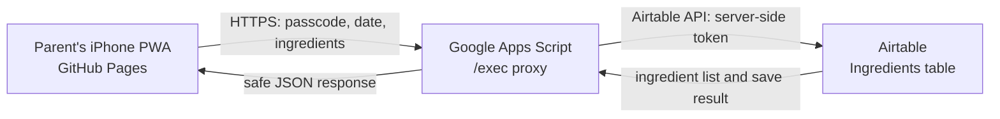

# Repository Guide

Read this file before changing this repository. It is the operating source of truth for future Codex/GPT sessions and maintainers. For the detailed product and implementation contract, read `docs/llm-build-handoff.md` next; it remains authoritative if the documents conflict.

## What this project is

Magnus 100 Foods is a small, mobile-first PWA for two parents to track a child's first exposure to distinct ingredients. It is deliberately an ingredient tracker, not a meal diary:

- Track one ingredient record per canonical ingredient key.
- Store the earliest first-exposure date.
- Do not store raw meal text, recipes, parent identities, portions, allergy data, or a meal-event history.
- Do not add Meals, Aliases, linked-record tables, or synonym matching without an explicit product decision.

## Architecture at a glance

Think of the app as three small pieces. The public web app is the screen parents use; it cannot hold a secret. Google Apps Script is the locked middle layer. Airtable is the editable family database.



| Piece | What it does | What it stores | What it must never contain |
| --- | --- | --- | --- |
| GitHub Pages PWA | Shows the intake screen, parses the typed list for preview, and displays results. | Endpoint setting on that device; a convenience copy of the latest snapshot; an unsaved offline draft. | Airtable token, base ID, passcode hash/salt, or a built-in endpoint value. |
| Apps Script proxy | Checks the passcode, normalizes again on the server, prevents duplicates, and calls Airtable. | Airtable token/base ID and passcode hash/salt in **Script Properties** only. | Plain passcode, raw pasted meal text, or a durable meal history. |
| Airtable | Is the family’s editable source of ingredient records. | One `Ingredients` table. | Tokens, passcodes, or a raw meal diary. |

### What happens when a parent saves

1. A parent enters a simple ingredient list, for example `blended prawns, carrot, and corn`.
2. The PWA previews `prawn`, `carrot`, and `corn`; the preview is helpful but not authoritative.
3. The PWA sends only the candidate ingredients and selected date to the Apps Script `/exec` URL over HTTPS. It never sends a raw meal record to Airtable.
4. Apps Script checks the passcode, normalizes the ingredients again, takes a short lock to avoid two parents creating duplicates, then reads/writes Airtable.
5. Apps Script replies with what was new, already known, or corrected to an earlier first-exposure date. The PWA refreshes its list from that response.

### What a parent needs to manage

| If you want to… | Use… | Why |
| --- | --- | --- |
| Add foods or see progress | The PWA on an iPhone | Fast daily intake. |
| Correct a name/key typo or inspect all rows | Airtable | It is the editable source of truth. |
| Change a token, base ID, or shared passcode | Apps Script Script Properties | Secrets stay off the public site and out of Git. |
| Change app screens or behavior | This GitHub repository | A push to `main` rebuilds the public PWA. |
| Change Airtable-proxy logic | `apps-script/` plus the live Apps Script project | The files must be copied/deployed manually after a change. |

The public app URL is `https://clemwgk.github.io/magnus-100-food-tracker/`. It is intentionally reachable without a login, but it does not ship a configured endpoint or any family data. The `/exec` endpoint is also public-reachable by design; `snapshot` and `saveIngredients` require the shared family passcode, and only `health` is unauthenticated and non-sensitive.

## Source-of-truth order

1. This guide: how to work safely in this repository and current deployment facts.
2. `docs/llm-build-handoff.md`: product architecture, API contract, acceptance criteria, and QA requirements.
3. Current handwritten source under `src/` and `apps-script/`: actual implementation behavior.
4. Older split documents under `docs/`: useful background only; do not let them override the handoff.

When changing behavior, update the relevant guide text, tests, and the implementation together.

## Data model and corrections

The only Airtable data table is `Ingredients` with these fields:

| Field | Meaning |
| --- | --- |
| Name | Display name, for example `Cauliflower`. |
| Key | Canonical lowercase dedupe key, for example `cauliflower`. |
| First Exposure Date | Earliest known date, stored as date-only. |
| Notes | Optional unstructured note. |
| Created At | Airtable-generated timestamp. |

### Correcting a typo

The MVP does not yet offer in-app editing. Correct a typo directly in Airtable:

1. Find the affected `Ingredients` row.
2. Edit both `Name` and the matching lowercase `Key`.
3. If the corrected key already exists, retain the correct row and the earliest `First Exposure Date`, then remove the typo row.

Do not re-enter the corrected ingredient in the app as a substitute for correcting the row: a typo such as `cauliflower puree` and `cauliflower` are different keys. Re-submitting an ingredient with an *earlier* date is safe and moves its date earlier; the app never moves a date later.

## User-facing behavior

- A parent may enter ingredients as one line, separated by commas, semicolons, new lines, or the standalone word `and`.
- Example: `blended prawns, carrot, and corn` becomes `prawn`, `carrot`, and `corn`.
- The normalizer removes selected leading preparation words and applies conservative plural handling. It does not infer recipe ingredients or merge synonyms.
- A mixed dish must be entered as its actual ingredients, for example `chicken, rice, carrot`, not `chicken porridge`.
- The in-app **How it works** panel is the short parent-facing guide. Keep it aligned with this document.

## Secrets and public-repository safety

Never put any of these into source, Markdown, GitHub Actions variables, browser storage defaults, screenshots, or chat:

- Airtable token or base ID
- family passcode, hash, or salt
- deployed Apps Script URL
- actual ingredient history or other family data

Store only these values in Google Apps Script Script Properties:

```text
AIRTABLE_TOKEN
AIRTABLE_BASE_ID
FAMILY_PASSCODE_HASH
FAMILY_PASSCODE_SALT
```

`docs/airtable token magnus tracker.txt` is deliberately ignored by Git and must never be opened, staged, or copied into another tracked file. If it contains a real token, remove it from the local workspace after confirming it is safely stored in the password manager.

Use the neutral public Git identity below for every commit in this repository:

```text
Magnus Food Tracker <noreply@users.noreply.github.com>
```

Do not use a personal name or email in commits. Run `git log --all --format='%an <%ae>'` before publishing if identity is in doubt.

## Development and release

Use `npm.cmd` in PowerShell on this computer.

```powershell
npm.cmd ci
npm.cmd run lint
npm.cmd run test
npm.cmd run test:e2e
npm.cmd run secret:scan
npm.cmd run build
```

- `npm.cmd run dev` starts the local app.
- The Pages workflow in `.github/workflows/deploy-pages.yml` deploys pushes to `main` under the repository path.
- The Apps Script files do not auto-deploy. After changing anything in `apps-script/`, copy the changed code into Apps Script and update the existing Web App deployment with **New version**, then retest `/exec`.
- Live proxy/Airtable tests must use a separate disposable base and the documented local-only environment variables. Never use the family base for automated write tests.

## Change checklist

Before committing a user-facing or proxy change:

1. Preserve the ingredient-only scope unless a new scope decision is explicit.
2. Add or update tests for behavior changes.
3. Run the relevant checks above and `npm.cmd run secret:scan`.
4. Confirm no configured endpoint or secret value is in the diff.
5. Keep the in-app guide and this document current.
6. Commit and publish with the neutral Git identity.
