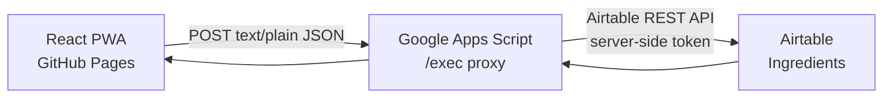

# Technical guide

This is the authoritative implementation guide for future AI instances and maintainers. It describes the current system and the rules that changes must preserve. The [product brief](PRODUCT_BRIEF.md) explains why these choices were made; it does not override this document.

When implementation, tests, and this guide conflict, inspect the current source and tests first, then update this guide as part of the change.

## Product invariants

- This is an ingredient-first-exposure tracker, not a meal diary.
- Airtable has one application data table: `Ingredients`.
- The record for a canonical ingredient key retains its earliest `First Exposure Date`.
- The frontend may preview a parse, but the Apps Script proxy is authoritative for normalisation and de-duplication.
- The browser must never receive an Airtable token, base ID, passcode hash/salt, or preconfigured proxy URL.
- Automated live writes must use a disposable base, never family data.

## Architecture

The Apps Script proxy is the server-side go-between that holds the Airtable token,
because a free static site cannot store a secret (the [product brief](PRODUCT_BRIEF.md#why-a-phone-app-cant-talk-to-the-database-directly)
explains why direct browser-to-Airtable access is not an option). The browser never
sees the token.



| Layer | Role | Main source |
| --- | --- | --- |
| PWA | Intake, local parse preview, progress, search, settings, local draft/snapshot cache. | `src/app/App.tsx`, `src/lib/` |
| Apps Script proxy | Authenticates the shared passcode, normalizes again, serializes saves, and reads/writes Airtable. | `apps-script/` |
| Airtable | Editable family source of truth. | One manually configured `Ingredients` table |
| GitHub Pages | Builds and hosts the static PWA. | `.github/workflows/deploy-pages.yml` |

### Repository map

| Path | Responsibility |
| --- | --- |
| `src/app/App.tsx` | Screen composition, local persistence, submission and refresh flows, in-app parent guide. |
| `src/lib/api.ts` | Browser-facing proxy client. Sends JSON as `text/plain` without custom auth headers. |
| `src/lib/normalize.ts` | Client parse and preview logic. |
| `src/lib/dateOnly.ts` | Local calendar-date helpers; do not round-trip date-only values through UTC timestamps. |
| `src/lib/saveService.ts` | Testable client save behaviour. |
| `apps-script/Code.gs` | Web-app routes, validation, save orchestration, and safe JSON responses. |
| `apps-script/auth.gs` | Script Properties lookup, passcode verification, and throttling. |
| `apps-script/airtable.gs` | Airtable REST reads, writes, pagination, and record mapping. |
| `apps-script/normalization.gs` | Server-side candidate normalization. |
| `tests/unit/`, `tests/integration/`, `tests/prebuild/` | Unit, integration, and guarded live proxy/Airtable checks. |

## Data model

The Airtable base has exactly one data table, `Ingredients`, with these fields:

| Field | Airtable type | Rule |
| --- | --- | --- |
| `Name` | Single line text, primary | Display value, for example `Cauliflower`. |
| `Key` | Single line text | Lowercase canonical de-duplication key, for example `cauliflower`. |
| `First Exposure Date` | Date, no time | Earliest known exposure, stored as `YYYY-MM-DD`. |
| `Notes` | Long text | Optional, unstructured family note. |
| `Created At` | Created time | Airtable-managed timestamp. |

Do not add meals, aliases, links, lookups, raw pasted meal text, parent identity, allergy data, or a separate event history without an explicit product decision.

To correct a simple typo, edit both `Name` and its matching lowercase `Key` in Airtable. If the corrected key already exists, keep the correct row with its earliest date and remove the duplicate row. Do not re-enter the ingredient through the PWA as a correction.

## Browser and proxy contract

The proxy is a Google Apps Script web app using its production `/exec` URL.

| Request | Access | Response purpose |
| --- | --- | --- |
| `GET?action=health` | Public | Boolean configuration status only; no property values. |
| `POST { action: "snapshot", passcode }` | Shared passcode | Summary and ingredient list. |
| `POST { action: "saveIngredients", passcode, exposureDate, ingredients }` | Shared passcode | Creates missing ingredients, reports known ones, and applies earlier-date corrections. |
| `POST { action: "verifyTestTarget", passcode, expectedBaseId }` | Shared passcode, test-only | Proves the separate proxy targets the named disposable base before a test writes. |

Browser requests must remain simple: JSON body with `Content-Type: text/plain;charset=utf-8`, no `Authorization` header, and no custom headers. The API returns either successful data or a safe `{ ok: false, code, message }` response; it must not expose stack traces or Airtable details.

On save, the proxy validates input, normalizes ingredient candidates, takes an Apps Script lock, reads the current ingredient records, creates only missing keys, and updates a stored date only when the submitted date is earlier. This server-side re-read is the protection against simultaneous saves from two devices.

### Response shapes

Every successful response is JSON. Error responses are `{ ok: false, code, message }`
(see [Error codes](#error-codes)). Successful shapes by action:

| Action | Successful response |
| --- | --- |
| `GET?action=health` | `{ ok: true, service: "magnus-food-tracker", configured: { airtableToken, airtableBaseId, familyPasscode } }` — each `configured` flag is a boolean only, never the value. |
| `snapshot` | `{ summary: { totalIngredients, goal: 100 }, ingredients: [{ id, name, key, firstExposureDate, notes }] }` |
| `saveIngredients` | `{ summary: { totalIngredients, goal: 100 }, created: [...], alreadyKnown: [...], dateCorrected: [...], allIngredientKeys: [string] }` — each list holds ingredient objects; `allIngredientKeys` is the normalized keys from this submission. |
| `verifyTestTarget` | `{ ok: true, verified: true }` |

Ingredient objects mirror the Airtable mapping in `apps-script/airtable.gs`: `id`, `name`, `key`, `firstExposureDate` (`YYYY-MM-DD`), `notes`.

### Input limits

`saveIngredients` rejects input that violates any of these (defined in `apps-script/Code.gs` and `apps-script/normalization.gs`):

- `exposureDate` must match `YYYY-MM-DD` and be a real calendar date.
- `ingredients` must be an array of 1-20 strings, each ≤200 characters.
- After normalization, each candidate key must be non-empty and ≤80 characters; otherwise that candidate is dropped, and a submission that normalizes to nothing is rejected.

### Error codes

All client-facing errors return `{ ok: false, code, message }` with one of these codes. Messages are intentionally generic; never widen them to include Airtable details or stack traces.

| Code | Meaning / trigger | Source |
| --- | --- | --- |
| `INVALID_ACTION` | Missing/unknown action, or an unparseable JSON body. | `Code.gs` |
| `INVALID_PASSCODE` | Passcode did not match. | `auth.gs` |
| `PASSCODE_THROTTLED` | Too many failed passcode attempts (see below). | `auth.gs` |
| `CONFIGURATION_ERROR` | Required Script Properties are missing, or `verifyTestTarget` base mismatch. | `auth.gs`, `airtable.gs`, `Code.gs` |
| `INVALID_DATE` | `exposureDate` is missing or not a valid `YYYY-MM-DD` date. | `Code.gs` |
| `INVALID_INGREDIENTS` | Ingredient list fails the input limits, or normalizes to nothing. | `Code.gs` |
| `CONFLICT_RETRY` | Could not acquire the script lock within 5s; another save is in progress. | `Code.gs` |
| `AIRTABLE_ERROR` | Airtable was unreachable, returned a non-2xx status, or sent an unreadable body; also the fallback for any unhandled server error. | `airtable.gs`, `Code.gs` |

### Passcode protection

The passcode is never stored in plaintext. `auth.gs` keeps a salt and a SHA-256 hash of `salt + ":" + passcode` in Script Properties, and compares using a constant-time check. Failed attempts are counted per-passcode-hash in the script cache: after `PASSCODE_MAX_FAILURES_` (5) failures the proxy returns `PASSCODE_THROTTLED` for `PASSCODE_THROTTLE_SECONDS_` (300s) before allowing further attempts.

## Normalization and device behaviour

Input is split on commas, semicolons, new lines, or standalone `and`. A limited list of leading preparation words is removed, punctuation and whitespace are normalized, and a conservative plural rule is applied. The system does not infer ingredients from a dish or merge synonyms; a duplicate is safer than an incorrect historical merge.

The PWA service worker caches the app shell only, never API responses. Browser storage contains the endpoint setting, an unsent draft, and a last successful snapshot. The endpoint must be entered once in each browser or separately installed PWA context; the shared passcode is memory-only for the current session. Failed saves leave the typed draft available to retry.

## Extending the proxy: adding a new action

Follow the existing conventions in `apps-script/` when adding behaviour:

1. **Register the action string** in the allow-list inside `routePost_` (`Code.gs`) and dispatch to a handler. Unknown actions must throw `INVALID_ACTION`.
2. **Rely on central passcode enforcement.** `routePost_` calls `requirePasscode_` before dispatch, so every non-`health` action is already gated; do not re-implement auth in the handler. `health` is the only public action and lives in `doGet`.
3. **Name private helpers with a trailing underscore** (`saveIngredients_`, `airtableRequest_`, `jsonResponse_`). Only `doGet`/`doPost` are public entry points.
4. **Signal client errors by throwing `ApiError_(code, message)`** with a generic message. `doPost` converts anything else into a safe `AIRTABLE_ERROR`, so never let raw errors, Airtable bodies, or stack traces reach the client.
5. **Return plain objects**; `doPost` serializes them through `jsonResponse_`. Do not build responses by hand.
6. **For any write, take the script lock** (`LockService.getScriptLock`, `tryLock(5000)` → `CONFLICT_RETRY`) and re-read Airtable inside the lock, mirroring `saveIngredients_`. This is what keeps concurrent device saves safe.
7. **Reach Airtable only through `airtableRequest_`** so token handling, base addressing, pagination, and error mapping stay in one place. Batch writes are chunked at 10 records (`createIngredients_`/`updateIngredients_`).
8. **Keep the product invariants** above: no new tables or fields, no token exposure, and update the [browser and proxy contract](#browser-and-proxy-contract), [response shapes](#response-shapes), and [error codes](#error-codes) tables in this guide as part of the change.

After editing `apps-script/`, manually copy the code into the Apps Script project and publish a new Web-app version (see below).

## Secrets and deployment configuration

The only permitted location for the following values is **Google Apps Script Script Properties**:

```text
AIRTABLE_TOKEN
AIRTABLE_BASE_ID
FAMILY_PASSCODE_HASH
FAMILY_PASSCODE_SALT
```

Never put actual values, a deployed proxy URL, or family ingredient records in source, GitHub Actions variables, frontend build variables, logs, screenshots, issues, or documentation.

### Initial setup

1. Create the Airtable `Ingredients` table with the exact schema above.
2. Create a Personal Access Token restricted to that base with record read/write permissions. The optional live test also needs schema-read permission; do not grant schema-write permission.
3. In a standalone Apps Script project, copy the files in `apps-script/` and replace the manifest with `apps-script/appsscript.json`.
4. Add the four Script Properties directly in the Apps Script interface. Generate the passcode verifier values locally with `npm.cmd run make:passcode-hash`; the helper hides input and writes no passcode to disk.
5. Deploy the project as a Web app, execute as the owner, and choose an access setting that permits the PWA to reach it. Use the production `/exec` URL, never `/dev`.
6. In the PWA Settings panel, save the `/exec` URL on each device and enter the family passcode for the current session.

After changing `apps-script/`, manually copy the modified code into Apps Script and publish a new Web-app version. The GitHub repository cannot deploy Apps Script for you.

## Development and verification

Use `npm.cmd` in PowerShell on this Windows setup:

```powershell
npm.cmd ci
npm.cmd run dev
npm.cmd run lint
npm.cmd run test
npm.cmd run test:e2e
npm.cmd run secret:scan
npm.cmd run build
```

The Pages workflow runs install, lint, unit/integration tests, secret scan, and a production build for pushes to `main`. It deploys the resulting `dist` directory under the repository path.

### Guarded live check

Never test automated writes against a family base. Create a disposable base with the exact schema and a separate Apps Script deployment configured for it. Set values only in the current terminal session:

```powershell
$env:RUN_LIVE_PREBUILD_TESTS='true'
$env:APPS_SCRIPT_URL='https://script.google.com/macros/s/.../exec'
$env:TEST_FAMILY_PASSCODE='your passcode'
$env:TEST_AIRTABLE_BASE_ID='app...'
$env:TEST_AIRTABLE_TOKEN='a token restricted to the disposable base'
npm.cmd run test:prebuild
```

The test refuses to write until `verifyTestTarget` confirms that the proxy base ID exactly equals `TEST_AIRTABLE_BASE_ID`. It then checks health, passcode rejection, schema, create/read/backdate behaviour, and cleanup.

## Change checklist

Before publishing a change:

1. Preserve the product invariants above unless the product brief is deliberately revised too.
2. Update implementation, tests, and this technical guide together.
3. Run the applicable checks and always run `npm.cmd run secret:scan`.
4. Inspect the diff for secrets, endpoint values, or family data.
5. For a public commit, use the neutral identity:

   ```powershell
   git -c user.name='Magnus Food Tracker' -c user.email='noreply@users.noreply.github.com' commit -m 'Describe the change'
   ```
